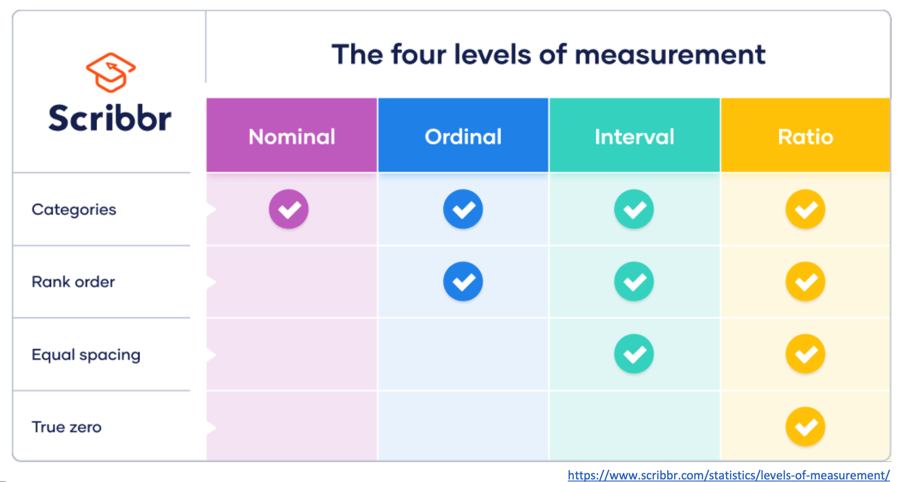
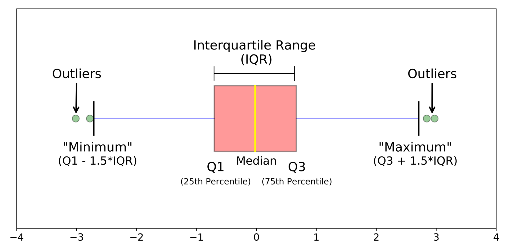

# Data Science
**Descriptive** and **Diagnostic** analytics describe the **past**. 用**描述性**和**诊断性**的分析描述**过去**。 
**Predictive** and **Prescriptive** analytics describe the **future**. 用**预测性**和**规范性**的分析描述**未来**。

## 1. Introduction
### 1.1 Data and Dataset
#### 1.1.1 What is data?
Data are **facts**, **statistics**, or **values** that **convey** information, which can be **structured** (tables, databases) or **unstructured** (slides, documentation). 
数据是**事实**、**统计数据**或**数值**，能够传达信息，可以是**结构化的**（表格、数据库）或**非结构化的**（幻灯片、文档）。

#### 1.1.2 What is a dataset?
A dataset consists of **rows** and **columns**:
- Rows represent observations (also known as the **target**). 行代表观察结果（也称为**目标**）。
- Columns represent variables (also known as **features**). 列代表变量（也称为**特征**）。

#### 1.1.3 Types of data
- **Categorical 分类数据**: Data that can be divided into distinct groups or categories. 可以划分为不同组或类别的数据。
- **Numerical 数值数据**: Data that is expressed as a number and can be measured. 以数字表达并可以测量的数据。

#### 1.1.4 Levels of Measurement

Levels of measurement determine how data can be analyzed and interpreted:
- **Nominal** 名义
- **Ordinal** 序数
- **Interval** 区间
- **Ratio** 比率

### 1.2 CRISP-DM (Cross Industry Standard Process for Data Mining) 跨行业数据挖掘标准过程
CRISP-DM is a framework or model for conducting data science projects, which outlines a step-by-step process(CRISP-DM 是一个执行数据科学项目的框架或模型，概述了一个分步过程)：
1. **Business Understanding 业务理解** (define the 'why' behind the project)
2. **Data Understanding** (get to know your data)
3. **Data Preparation** (prepare the data for analysis)
4. **Modelling** (build models that answer questions 构建回答问题的模型)
5. **Evaluation 评估** (assess if the model meets business needs 评估模型是否满足业务需求)
6. **Deployment 部署** (deliver results that create impact 交付产生影响的结果; optional)

## 2. Business Understanding
- **Business Objective 商业目标**: Understand what the organization aims to achieve.
- **Business Objective Success Criteria 商业目标成功标准**: Know when the objective is successfully met.
- **Data Mining Goal 数据挖掘目标**: Define what we as data scientists can do in this process.
- **Data Mining Success Criteria 数据挖掘成功标准**: Establish when we have been successful as data scientists.

## 3. Data Understanding
In Business Understanding, stakeholders often request an **average (mean)**, but this may not always be the best measure.

### 3.1 Describing Your Data
Characteristics of a numerical variable:
- **Minimum**: The lowest value in the dataset.
- **Maximum**: The highest value in the dataset.

### 3.2 Central Tendency 中心趋势
- **Mean 均值**:
  - The average of a dataset calculated as the sum of all values divided by the total number of values. 数据集的平均值，计算方法是所有值的总和除以值的总数。
  - Uses all data points. 使用所有数据点。
  - Sensitive to outliers. 对异常值敏感。

- **Median 中位数**:
  - The middle value in a dataset ordered from least to greatest. 数据集中从最小到最大排序的中间值。
  - For even datasets, it is the average of the two middle values. 对于偶数个数据的数据集，它是两个中间值的平均值。
  - Robust to outliers. 对异常值有较强的抵抗力。

- **Mode 众数**:
  - The most frequently occurring value in a dataset. 数据集中出现频率最高的值。
  - Particularly useful for categorical data. 对于分类数据特别有用。

### 3.3 Distributions 分布
**Variance (σ²) 方差**: Measures how far a set of data points are spread out. 测量一组数据点的分散程度。
- Calculate the difference between each data point and the mean. 计算每个数据点与均值之间的差异。
- Square all these differences. 将这些差异平方。
- Calculate the average of these squared differences -> Variance (σ²). 计算这些平方差的平均值 -> 方差（σ²）。

#### 3.3.1 Normal Distribution 正态分布
- **Standard Deviation 标准差**:
    - Square root of the variance. 方差的平方根。
    - Indicates the distance between the data points and the mean. 表示数据点与均值之间的距离。
    - Used to determine whether a value is an outlier. 用于确定是否为异常值。
- **Low standard deviation**: Values are close to the mean. 值靠近均值。
- **High standard deviation**: Values are spread out over a wider range. 值在更广泛的范围内分散。
- **Symmetric Distribution**: Mean, Median, and Mode are approximately the same. 均值、中位数和众数大致相同。

#### 3.3.2 Skewed Distribution 偏态分布
- Not symmetric. 不对称。
- **Positive Skew 正偏态** (Right-skewed 右偏): Tail on the right side; Mean > Median. 尾部在右侧；均值 > 中位数。
- **Negative Ske 负偏态w** (Left-skewed 左偏): Tail on the left side; Mean < Median. 尾部在左侧；均值 < 中位数。

### 3.4 Outliers 异常值
- **Values at the extreme ends of the dataset 数据集极端端点的值**. 
- Can be a true value or an error. 可能是真实值也可能是错误。

#### 3.4.1 How to Detect Outliers
If a value is bigger or smaller than 3 times the standard deviation (σ). 如果一个值大于或小于标准差的3倍（σ）。
1. **Z-score** calculation for normal distributions. 适用于正态分布的计算。
2. **Interquartile Range (IQR) 四分位距**:
  - Split your dataset into four equal parts. The quartiles mark these divisions. 将数据集分成四等分。四分位数标记这些划分。
  - **Q1**: 25% of data points are below this value. 25%的数据点低于此值。
  - **Q2**: The median; 50% of data points are below and above. 中位数；50%的数据点低于此值，50%的数据点高于此值。
  - **Q3**: 75% of data points are below this value. 75%的数据点低于此值。
  - **IQR**: Range between Q1 and Q3; encompasses the middle 50% of your data. Q1与Q3之间的范围；包括数据的中间50%。
3. Visually via **histogram** and **boxplot**. 通过**直方图**和**箱形图**直观显示。
  

#### 3.4.2 Handling Outliers
- **True Value Outliers**: Keep these in your dataset as they represent the variance in your data. 保留在数据集中，因为它们代表了数据的变异性。
- **Error Outliers**: You may remove or change these. 可以移除或更改这些值。

Presence of many true outliers can influence data science decisions. 多个真实异常值的存在可能会影响数据科学决策。 
Some machine learning algorithms are more robust to outliers than others. 一些机器学习算法对异常值更为稳健。

## 4. Data Preparation
### 4.1 Different Errors
- **Typos**: e.g., "Asmterdam" -> "Amsterdam", "1234a" in a numerical column.
- **Duplications**: Multiple entries of the same data. 相同数据的多次条目。
- **Missing values**: Absence of data points.
- **Inconsistent data formats 数据格式不一致**: e.g., MM-DD-YYYY vs. DD-MM-YYYY.
- **Inconsistent values 值不一致**: e.g., "St." vs. "Street".
- **Inconsistent units of measurement 测量单位不一致**: e.g., meters vs kilometers.

Modifying datasets can have significant consequences, such as over-imputing missing values or altering raw data in ways that distort reality. Be aware of the order of the steps you take, as they may influence each other.  
修改数据集可能会产生重大后果，如过度插补缺失值或以扭曲现实的方式更改原始数据。请注意你采取的步骤顺序，因为它们可能会相互影响。

#### 4.1.1 Typos
如何找到typos错误：
**Visual inspection 视觉检查** or using `pandas.unique`.
解决方式：
- Using `pandas.Series.str.replace`: `df["City"] = df["City"].str.replace("Asmterdam", "Amsterdam")`

其他调整方式：
- `pandas.Series.str.lower`
- `pandas.Series.str.upper`
- `pandas.Series.str.capitalize`

#### 4.1.2 Inconsistent Data Formats and Values 数据格式和值的不一致
解决方式：
1. Can be fixed using replacements and ensuring the correct data type is maintained (especially important for datetime formats). 可以通过替换确保维持正确的数据类型（特别是日期时间格式）来修正。
2. Recalculate or transform values for consistent units of measurement. 重新计算或转换值以保持测量单位的一致性。

#### 4.1.3 Duplicates
原因：
- Merge errors (e.g., merging without using keys). 合并错误（例如，未使用键进行合并）。
- Data entered multiple times. 数据被多次输入。

如何找到重复项：
- Visual inspection. 视觉检查。
- Using `df.duplicated()` and `df[df.duplicated()]`

解决方式：
- Using `df = df.drop_duplicates()`

#### 4.1.4 Missing Values
原因：
- Human input error during data collection. 在数据收集过程中人为输入错误。
- Failures in systems (e.g., a sensor not recording). 系统故障（例如，传感器未记录）。
- Omissions due to privacy concerns. 由于隐私问题而省略数据。

形式：
- **Missing Completely At Random (MCAR) 完全随机缺失**: No bias introduced. 未引入偏差。
- **Missing At Random (MAR) 随机缺失**: Bias introduced; related to other observed variables. 引入偏差；与其他已观察变量相关。
- **Missing Not At Random (MNAR) 非随机缺失**: Bias introduced; very difficult to adjust for. 引入偏差；非常难以调整。

识别：
- Visual inspection. 视觉检查。
- Using `pandas.DataFrame.isna` or its alias `pandas.DataFrame.isnull`.

解决：
- Removing or correcting errors (imputation). 移除或纠正错误（插补）。
    - If a column has >50% or >70% missing values, consider removing it. 如果某列的缺失值超过50%或70%，考虑移除它。
    - Remove rows with missing values that cannot be imputed using `pandas.DataFrame.dropna`. 移除无法插补的缺失值行
- Filling gaps with logical data: Mean imputation. Median imputation. 用逻辑数据填补空缺：平均数插补、中位数插补。
    - Using `pandas.DataFrame.fillna`, `numpy.median`, `numpy.mean`.

影响：
- Inflated counts. 膨胀计数。
- Incorrect aggregations and statistics. 不正确的汇总和统计。
- Introduced bias. 引入偏见。
- Reduced data size. 减少数据大小。

## 5. Modeling
Models are representations of reality used to understand, predict, or control real-world phenomena. All models are approximations, usually with a trade-off between **Simplicity** and **Accuracy**.  
模型是用于理解、预测或控制现实世界现象的现实表征。所有模型都是近似值，通常在**简单性**与**准确性**之间需要权衡。

### 5.1 Machine Learning
- A machine learning model is a program that finds patterns or makes decisions from data it has never seen before. 机器学习模型是一个从未见过的数据中发现模式或做出决策的程序。
- It learns from historical data (**training**) and applies this knowledge to make predictions on new data (**testing**). 它从历史数据中学习（**训练**），并将这些知识应用于新数据的预测（**测试**）。
  - **Automates decision-making processes**. **自动化决策过程**。
  - Able to handle large and complex datasets. 能够处理大型和复杂的数据集。
  - Can be improved and can improve itself. 可以改进并自我提升。

#### 5.1.1 Types of Machine Learning
- **Supervised Learning 监督学习**: Uses labeled data where the target label is defined. 使用已定义目标标签的标记数据。
- **Unsupervised Learning 非监督学习**: Uses unlabeled data where the target label is not defined. 使用未定义目标标签的非标记数据。
- **Reinforcement Learning 强化学习**: The model rewards and punishes itself, thereby improving. 模型通过自我奖励和惩罚来改进。

#### 5.1.2 Neural Networks
- Inspired by the way our brain works (neurons, synapses). 灵感来源于我们大脑的工作方式（神经元、突触）。
- Input activates the connections in the layers. 输入激活层中的连接。
- Strength of signal is determined by the weight that changes during the training process. 信号的强度由训练过程中改变的权重决定。
- Usually involves multiple layers (-> deep learning). 通常涉及多个层（-> 深度学习）。
- Often considered a **black box model**, not explainable. 经常被视为**黑箱模型**，无法解释。

### 5.2 Regression Models 回归模型
- **Supervised machine learning technique 监督机器学习技术**.
- Predicts a continuous numerical value (target) based on input features. 根据输入特征预测连续的数值（目标）。
- Tries to find the relationship between the features and the target. 尝试找出特征与目标之间的关系。

### 5.3 Visualization Techniques 可视化技术
- **Scatter Plot 散点图**:
  - Shows how multiple variables move together. 显示多个变量如何一起移动。
  - Each axis represents a variable. 每个轴代表一个变量。
  - Shows trends (correlation). 显示趋势（相关性）。
  - Ideal for paired numerical values. 适用于成对的数值。
  - Dependent variable on Y-axis (the target). 依赖变量在Y轴上（目标）。
- **Line Graph 线图**:
  - Connects the data points in a scatter plot using a line. 使用线连接散点图中的数据点。
  - Used to show data over time (X-axis = time). 用于显示随时间变化的数据（X轴=时间）。
  - Connects datapoints, showing patterns. 连接数据点，显示模式。
  - May mislead if the line between datapoints does not represent actual data points. 如果线条之间的数据点不代表实际数据点，可能会导致误解。

### 5.4 Benchmark Models 基准模型
- A benchmark provides a baseline for comparing more advanced models. 基准提供了一个比较更高级模型的基线。
- Simple. 简单。Interpretable. 可解释。

### 5.5 Metrics 指标
- **Mean Absolute Error (MAE) 平均绝对误差**:
  - An evaluation metric for regression models. 回归模型的评估指标。
  - The average of the absolute differences between the actual values and the predicted values. 实际值与预测值之间绝对差的平均值。

### 5.6 Training & Testing
- Data needs to be split into a **train set** and a **test set**. 数据需要分为**训练集**和**测试集**。
  - Train data helps discover the right patterns. 训练数据帮助发现正确的模式。
  - Test data checks if the model can generalize to new, never-seen-before data. 测试数据检查模型是否能概括到新的、从未见过的数据。
- Common splits include **70%-30%** or **80%-20%** (train-test). 常见的分割包括**70%-30%**或**80%-20%**（训练-测试）。
- Evaluation metrics tend to be better when testing the model on the train set than on the test set. 当在训练集上测试模型时，评估指标往往比在测试集上更好。